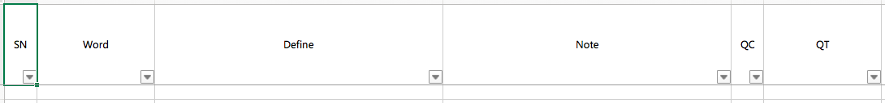
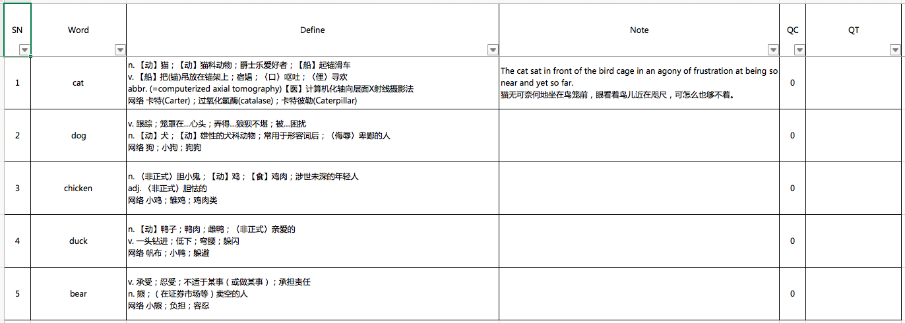

# MYDICTIONARY

[English Version](./README.md)

### 1. 简介

MYDICTIONARY是一个golang库。该库提供为开发者提供一组API，以帮助他们构建基于Excel表格与在线内容的词典应用程序。

### 2. 基本信息

#### 2.1. 词条

***词条*** 包括词汇、释义、笔记和其他必要信息。

从[这里](https://github.com/zzc-tongji/vocabulary4mydictionary/blob/master/README.zh-Hans.md)获取更多信息。

#### 2.2. 在线服务

MYDICTIONARY能够从网站获取页面、提取信息并构建*词条*。这个过程称为*在线服务*。这使我们能够获得*生词本*或*离线词典*中没有的*词条*。

MYDICTIONARY目前提供下列*在线服务*：

- 必应词典
- 金山词霸-柯林斯词典
- 韦氏词典

**声明:**

- **上述网站中一切信息的版权属于相应的公司。**
- **上述信息禁止用于一切形式的商业用途。**
- **滥用上述信息产生的一切后果与本人无关。**

从[这里](https://github.com/zzc-tongji/service4mydictionary/blob/master/README.zh-Hans.md)获取更多信息。

#### 2.3. 生词本和离线词典

词典应用程序需要利用文件存储词汇和释义。据我所知，这些文件一般都是特别设计的，用户不能自行查看或编辑。这曾经让我十分困惑。因此，在设计MYDICTIONARY的时候，我选择将数据存储在“.xlsx”文件中，这意味着用户能够方便地利用[Microsoft Excel](https://products.office.com/excel)或[WPS表格](http://www.wps.cn/product)进行读写操作。

所以符合下列条件“.xlsx”文件都能够作为 ***生词本文件*** 或 ***离线词典文件*** 。

- 至少包含一个工作表。
- 第一个工作表的首行包含下列单元格：“SN”（序号）、“Word”（词汇）、“Definition”（释义）、“Note”（笔记）、“QC”（查询次数）和“QT”（上次查询时间）。

例如：

- *生词本文件*`bing-dictionary.xlsx`



- *离线词典文件*`animal.xlsx`



***生词本*** 和 ***离线词典*** 都是*词条*的集合。它们分别是*生词本文件*和*离线词典文件*的内存映像。*生词本文件*或*离线词典文件*中的一行会被转化为*生词本*或*离线词典*中的一个*词条*。

*生词本*与*离线词典*具有相似的结构，它们的不同之处在于：

- 对于*离线词典*，在查询时，MYDICTIONARY能够更新现存*词条*的`QC`和`QT`（为`QC`加1，将`QT`设定为当前时间）。

- *生词本*的主要功能是记录满足下列**全部**条件的*词条*

  - 从*在线服务*中获得的
  - 不存在与任何*生词本*和*离线词典*中的

  因此，对于*生词本*，在查询时，MYDICTIONARY不仅能更新现存*词条*的`QC`和`QT`，**还能新增的*词条***。

上述更新和/或新增操作称为**记录**。

#### 2.4. 路径

MYDICTIONARY需要下列路径（目录）：

- ***工作路径*** ：存放*配置文件*。
- ***文档路径*** ：存放所有*生词本文件*和*离线词典文件*。
- ***缓存路径*** ：存放所有*在线服务*的缓存文件。

#### 2.5. 配置

***配置文件*** `mydictionary.setting.json`必须被放置在*工作路径*。

示例：

```json
{
	"collection": [
		{
			"name": "bing-dictionary",
			"fileName": "bing-dictionary.xlsx",
			"readable": true,
			"writable": true,
			"onlineSource": "Bing Dictionary"
		},
		{
			"name": "iciba-collins",
			"fileName": "iciba-collins.xlsx",
			"readable": true,
			"writable": true,
			"onlineSource": "iCIBA Collins"
		},
		{
			"name": "merriam-webster",
			"fileName": "merriam-webster.xlsx",
			"readable": true,
			"writable": true,
			"onlineSource": "Merriam Webster"
		}
	],
	"dictionary": [
		{
			"name": "animal",
			"fileName": "animal.xlsx",
			"readable": true,
			"writable": true
		},
		{
			"name": "fruit",
			"fileName": "fruit.xlsx",
			"readable": true,
			"writable": true
		}
	],
	"online": {
		"mode": 3,
		"service": {
			"Bing Dictionary": true,
			"iCIBA Collins": true,
			"Merriam Webster": true
		},
		"cache": {
			"enable": true,
			"shelfLifeDay": 7
		},
		"debug": false
	}
}
```

***配置*** 中有3个结构体：`"collection"`、`"dictionary"`和`"online"` 。

##### 2.5.1. collection

`"collection"`是一个数组，它的每一项具有下列成员：

- 字符串`"name"`：*生词本*的名称。
- 字符串`"fileName"`：*生词本文件*的名称，位于*文档路径*下。
- 布尔型`"readable"` ：如果设为`false`，那么*生词本*将被MYDICTIONARY忽略。通过这项设置，我们可以在不移除整个数组项的情况下，停用*生词本*。
- 布尔型`"writable"`：如果设为`true`，那么允许MYDICTIONARY**在查询的时候**将-*词条*-*记录*-到*生词本*。
- 字符串`"onlineSource"`：每个生词本只能从一个*在线服务*中*记录*-*词条*，但是MYDICTIONARY能够从多个不同的*在线服务*中获得*词条*。因此，我们需要该成员来记录*生词本*与*在线服务*之间的对应关系。该成员需要与`online.service`中的键名精确匹配。

##### 2.5.2. dictionary

`"dictionary"`是一个数组，它的每一项具有下列成员：

- 字符串`"name"`：*离线词典*的名称。
- 字符串`"fileName"`：*离线词典文件*的名称，位于*文档路径*下。
- 布尔型`"readable"` ：如果设为`false`，那么*离线词典*将被MYDICTIONARY忽略。通过这项设置，我们可以在不移除整个数组项的情况下，停用*离线词典*。
- 布尔型`"writable"`：如果设为`true`，那么允许MYDICTIONARY**在查询的时候**将-*词条*-*记录*-到*离线词典*。

##### 2.5.3. online

`"online"`是一个结构体，具有下列成员：

###### 2.5.3.1. mode

`"mode"`是个整数，它决定了在什么样的情况下，MYDICTIONARY会从*在线服务*获取*词条*（联网查询）。

取值如下：

- `0` ：MYDICTIONARY从不执行联网查询。
- `1`：如果用户需要，那么MYDICTIONARY执行联网查询。
- `2`：如果*词条*不存在所有的*生词本*和*离线词典*中，那么MYDICTIONARY执行联网查询。
- `3`：如果用户需要，或者*词条*不存在所有的*生词本*和*离线词典*中，那么MYDICTIONARY执行联网查询。
- `4`：MYDICTIONARY总是执行联网查询。

**如果难以理解以上描述，将`"mode"`设定为默认值`3`即可。**

###### 2.5.3.2. service

`"service"`是一个数组，每项的键-值对（字符串-布尔型）决定了是否启用该*在线服务*。

###### 2.5.3.3. cache

如果`"enable"`设定为`true`，那么MYDICTIONARY将缓存从*在线服务*获得的查询结果若干天（取决于`"shelfLifeDay"`）。**这会显著增加联网查询的速度。**

每个*在线服务*的缓存会对应一个同名缓存文件。缓存文件位于*缓存路径*下。

###### 2.5.3.4. debug

`"debug"`决定了MYDICTIONARY是否处于调试模式。默认值为`false`。非开发者请勿更改。从[这里](https://github.com/zzc-tongji/service4mydictionary/blob/master/README.zh-Hans.md#33-%E5%88%9B%E5%BB%BA%E8%87%AA%E5%AE%9A%E4%B9%89%E5%9C%A8%E7%BA%BF%E6%9C%8D%E5%8A%A1)获取更多信息。

### 3. API

#### 3.1. Initialize

```go
func Initialize(path []string) (success bool, information string)
```

该函数用于初始化MYDICTIONARY。

`path`是一个包含1-3个成员的切片：

- 如果`path`的长度为1，那么*工作路径*、*文档路径*和*缓存路径*均为`path[0]`。
- 如果`path`的长度为2，那么*工作路径*为`path[0]`，*文档路径*为`path[1]`，*缓存路径*为`path[0]`。
- 如果`path`的长度为3，那么*工作路径*为`path[0]`，*文档路径*为`path[1]`，*缓存路径*为`path[2]`。

函数执行的过程如下：

1. 设定路径。
2. 读取*配置文件*，生成并解析*配置*。
3. 读取*生词本文件*，生成*生词本*。
4. 读取*离线词典文件*，生成*离线词典*。
5. 加载*在线服务*的缓存文件。

**该函数应该在任何其他函数前调用。**

返回值：

- 如果成功，那么`success`为`true`。同时，*配置*的内容通过`information`返回。
- 如果失败，那么`success`为`false`。同时，错误信息通过`information`返回。

#### 3.2. CheckNetwork

```go
func CheckNetwork() (success bool, information string)
```

该函数通过请求[百度](https://www.baidu.com/)来检查网络。

返回值：

- 如果[百度](https://www.baidu.com/)可达，那么`success`为`true`。
- 否则，那么`success`为`false`。
- `information`将会提供更多的信息。

#### 3.3. Query

```go
func Query(vocabularyAsk VocabularyAskStruct) (success bool, vocabularyResult VocabularyResultStruct)
```

该函数是MYDICTIONARY的核心。

过程如下：

1. 在所有的*生词本*和*离线词典*中查询`vocabularyAsk`中的词汇，记录离线查询的结果。
2. 根据*配置*中的`online.mode`、`vocabularyAsk`中的选项以及离线查询的结果，决定是否进行在线查询。
3. 如果第2步的答案为”是“，那么执行在线查询并记录结果。由于使用了[goroutines](https://golang.org/doc/faq#goroutines)，MYDICTIONARY将会**同时查询所有的*在线服务***，这就意味着查询时间取决于响应时间最长的*在线服务*。
4. 通过`vocabularyResult`返回所有结果。

Return values:

- 如果成功，那么`success`为`true`，结果会通过`vocabularyResult`返回。
- 如果MYDICTIONARY还未被初始化，那么`success`为`false`。

#### 3.4. Save

```go
func Save() (success bool, information string)
```

该函数用于：

- 将*生词本*写回对应的*生词本文件*
- 将*离线词典*写回对应的*离线词典文件*
- 保存*在线服务*的缓存

返回值：

- 如果所有文件均写回成功，那么`success`为`true`。
- 否则，那么`success`为`false`。
- `information`将会提供更多的信息。

#### 3.5. Edit

```go
func Edit(vocabularyEdit VocabularyEditStruct) (success bool, information string)
```

该函数用于编辑*生词本*或*离线词典*中*词条*的释义和笔记。该函数**不受*配置*中`"writable"`的制约。**

返回值：

- 如果成功，那么`success`为`true`。
- 如果失败，那么`success`为`false`。
- `information`将会提供更多的信息。

### 4. 感谢

- 感谢[excelize](https://github.com/360EntSecGroup-Skylar/excelize)的提供者[xuri](https://github.com/xuri)。
- 感谢[goquery](https://github.com/PuerkitoBio/goquery)的提供者[PuerkitoBio](https://github.com/PuerkitoBio)。

### 5. 交流

- [反馈](https://github.com/zzc-tongji/mydictionary/issues)
- QQ群：657218106


### 6. 其他

- 所以代码文件是用[Atom](https://atom.io/)编写的。
- 所有".md"文件是用[Typora](http://typora.io)编写的。
- 所有".md"文件的风格是[Github Flavored Markdown](https://guides.github.com/features/mastering-markdown/#GitHub-flavored-markdown)。
- 各行以LF（Linux）结尾。
