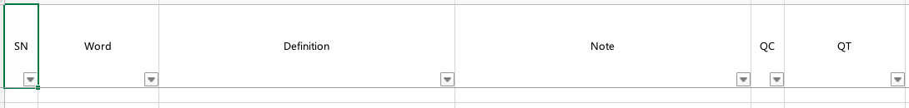

# MYDICTIONARY

[简体中文版](./README.zh-Hans.md)

### 1. Introduction

MYDICTIONARY is a library designed by golang. It provides the API for developers to build applications of excel-based and online dictionaries.

### 2. Basic Information

#### 2.1. Vocabulary

***Vocabulary*** contains word, definitions, notes and other necessary information.

Get further information from [here](https://github.com/zzc-tongji/vocabulary4mydictionary).

#### 2.2. Service

MYDICTIONARY can grasp pages from websites and extract information to build *vocabularies*. This process is called ***service***. By doing this, MYDICTIONARY enables us to get *vocabularies* which are not included in *collections* or *dictionaries*.

MYDICTIONARY provides these *services* currently:

- Bing Dictionary
- iCIBA Collins
- Merriam Webster

**Declaration:**

- **Copyrights of all information in aforementioned websites belong to corresponding companies.**
- **All of these information are prohibited for any form of commercial use.**
- **I am NOT accountable for misappropriation of these information.**

Get further information from [here](https://github.com/zzc-tongji/service4mydictionary).

#### 2.3. Collection & Dictionary

Dictionary applications need files to store words and definitions. As far as I know, most of these files are specially designed, which means users could not view or edit without using corresponding applications. It puzzles me sometimes. As a matter of fact, I choose to store data in ".xlsx" files when designing MYDICTIONARY, which means that users can easily read and write them by using [Microsoft Excel](https://products.office.com/excel) or [WPS表格](http://www.wps.cn/product).

All ".xlsx" files which march the following conditions could become ***collection files*** or ***dictionary files***.

- Contain at least one worksheet.
- In the first worksheet, cells of the first line should contain: "SN" (serial number), "Word", "Definition", "Note", "QC" (query counter) and "QT" (last query time).

Here are examples:

- *collection file* `bing-dictionary.xlsx`



- *dictionary file* `animal.xlsx`


***Collections*** and ***Dictionaries*** are composed of *vocabularies*. They are RAM images of *collection files* and *dictionary files*. Each line of *collection files* or *dictionary files* is converted to a *vocabulary* in *collections* or *dictionaries*.

*Collections* and *dictionaries* have similar structures, but there are still some differences:

- For *dictionaries*, MYDICTIONARY is able to update `QC` and `QT` (add 1 to `QC`, and set the current time to `QT`) of existent *vocabularies* when querying.

- The main function of *collections* is recording *vocabularies* which fulfill **all** of the following criteria:

  - come from *services*
  - are not existed in all *collections* and *dictionaries*

  So, for *collections*, MYDICTIONARY is able to update `QC` and `QT` of existent *vocabularies* in *collections* and **add new *vocabularies* as well** when querying.

The action of updating and/or adding is called ***record***.

#### 2.4. Path

These paths are needed by MYDICTIONARY (directory):

- ***Work path***: configuration file should be here.
- ***Document path***: collection files and dictionary files should be here.
- ***Cache path***: cache files of services should be here.

#### 2.5. Configuration

The ***configuration file*** `mydictionary.setting.json` should be placed at the *work path*.

Here is an example:

```json
{
	"collection": [
		{
			"name": "bing-dictionary",
			"fileName": "bing-dictionary.xlsx",
			"readable": true,
			"writable": true,
			"onlineSource": "Bing Dictionary"
		},
		{
			"name": "iciba-collins",
			"fileName": "iciba-collins.xlsx",
			"readable": true,
			"writable": true,
			"onlineSource": "iCIBA Collins"
		},
		{
			"name": "merriam-webster",
			"fileName": "merriam-webster.xlsx",
			"readable": true,
			"writable": true,
			"onlineSource": "Merriam Webster"
		}
	],
	"dictionary": [
		{
			"name": "animal",
			"fileName": "animal.xlsx",
			"readable": true,
			"writable": true
		},
		{
			"name": "fruit",
			"fileName": "fruit.xlsx",
			"readable": true,
			"writable": true
		}
	],
	"online": {
		"mode": 3,
		"service": {
			"Bing Dictionary": true,
			"iCIBA Collins": true,
			"Merriam Webster": true
		},
		"cache": {
			"enable": true,
			"shelfLifeDay": 7
		},
		"debug": false
	}
}
```

There are 3 structures in the ***configuration***: `"collection"`, `"dictionary"` and `"online"`.

##### 2.5.1. collection

`"collection"` is an array and each item in this array has got such members:

- String `"name"`: it is the name of the *collection*.
- String `"fileName"`: it is the file name of the *collection file* in *document path*.
- Boolean `"readable"`: if it is `false`, the *collection* will be ignored by MYDICTIONARY. By setting this, we can disable the *collection* without removing the whole array item.
- Boolean `"writable"`: if it is `true`, MYDICTIONARY will be allowed to *record* *vocabularies* of the *collection* **when querying**.
- String `"onlineSource"`: each *collection* is only able to record *vocabularies* from one *service*, but MYDICTIONARY can get *vocabularies* from several different *services*. So we need this member to indicate the corresponding relation between the *collection* and the *service*. This member should exactly match the key name in `online.service`.

##### 2.5.2. dictionary

`"dictionary"` is an array and each item in this array has got such members:

- String `"name"`: it is the name of the *dictionary*.
- String `"fileName"`: it is the file name of the *dictionary file* in *document path*.
- Boolean `"readable"`: if it is `false`, the *dictionary* will be ignored by MYDICTIONARY. By setting this, we can disable the *dictionary* without removing the whole array item.
- Boolean `"writable"`: if it is `true`, MYDICTIONARY will be allowed to *record* *vocabularies* of the *dictionary* **when querying**.

##### 2.5.3. online

`"online"` is a structure and has got these members:

###### 2.5.3.1. mode

`"mode"` is an integer. It determines on what condition MYDICTIONARY should provide *vocabularies* from *services* (query online).

Here is the possible value:

- `0`: MYDICTIONARY will never query online.
- `1`: MYDICTIONARY will query online, if users need.
- `2`: MYDICTIONARY will query online, if the *vocabulary* is not existent in all *collections* and *dictionaries*.
- `3`: MYDICTIONARY will query online, if users need OR the *vocabulary* is not existent in all *collections* and *dictionaries*.
- `4`: MYDICTIONARY will always query online.

**If it's hard to understand, set `"mode"` as `3` by default.**

###### 2.5.3.2. service

`"service"` is an array. The key-value (string-boolean) pair of each item determines whether the *service* is enabled.

###### 2.5.3.3. cache

If `"enable"` is `true`, MYDICTIONARY will cache query result from *services* for several days (determined by `"shelfLifeDay"`). **It can increase the speed of online query considerably.**

For each *service*, its cache will correspond to a cache file of the same name. These cache files are in *cache path*.

###### 2.5.3.4. debug

`"debug"` indicates whether MYDICTIONARY is in debug mode. The default value is `false`. Do not modify it if you are not developer. Get further information from [here](https://github.com/zzc-tongji/service4mydictionary#33-create-service-by-yourself).

### 3. API

#### 3.1. Initialize

```go
func Initialize(path []string) (success bool, information string)
```

The function is used to initialize MYDICTIONARY.

`path` is a string slice with 1-3 item(s).

- If the length of `path` is 1, *work path*, *document path* and *cache path* will be `path[0]`.
- If the length of `path` is 2, *work path* will be `path[0]`, *document path* will be `path[1]`, *cache path* will be `path[0]`.
- If the length of `path` is 3, *work path* will be `path[0]`, *document path* will be `path[1]`, *cache path* will be `path[2]`.

Here is the procedure of the function:

1. Set paths.
2. Read the *configuration file*, build and parse the *configuration*.
3. Read *collection files* and build *collections*.
4. Read *dictionaries files* and build *dictionaries*.
5. Load cache file of *services*.

**The function should be called before any other functions.**

Return values:

- If success, `success` will be `true`, and the content of the *configuration* will be returned by `information`.
- If failure, `success` will be `false`, the content of error will be returned by `information`.

#### 3.2. CheckNetwork

```go
func CheckNetwork() (success bool, information string)
```

The function requests [Baidu](https://www.baidu.com/) to check network.

Return values:

- If [Baidu](https://www.baidu.com/) is accessible, `success` will be `true`.
- If not, `success` will be `false`.
- `information` will provide further information.

#### 3.3. Query

```go
func Query(vocabularyAsk VocabularyAskStruct) (success bool, vocabularyResult VocabularyResultStruct)
```

It is the core function of MYDICTIONARY.

Here is the procedure:

1. Query the word in `vocabularyAsk` in all *collections* and *dictionaries*, record the result of offline query.
2. Determine whether the function should query online based on `online.mode` in the *configuration*, options in `vocabularyAsk` and the result of offline query.
3. If the answer of step 2 is "yes", then query online and record the result. By using [goroutines](https://golang.org/doc/faq#goroutines), MYDICTIONARY will **query all *services* at the same time**, which means that the query time depends on the *service* with longest request time.
4. Return all results by `vocabularyResult`.

Return values:

- If success, `success` will be `true`, and the result will be returned by `vocabularyResult`.
- If MYDICTIONARY has not been initialized, `success` will be `false`.

#### 3.4. Save

```go
func Save() (success bool, information string)
```

The function is used to:

- write *collections* back to corresponding *collection files*
- write *dictionaries* back to corresponding *dictionary files*
- save cache of *services*

Return values:

- If all files are successfully written back, `success` will be `true`.
- If not, `success` will be `false`.
- `information` will provide further information.

#### 3.5. Edit

```go
func Edit(vocabularyEdit VocabularyEditStruct) (success bool, information string)
```

This function is used to edit definitions and notes of a *vocabulary* in *collection* or *dictionary*. It **is NOT restricted by `"writable"` in *configuration***.

Return values:

- If success, `success` will be `true`.
- If failure, `success` will be `false`.
- `information` will provide further information.

### 4. Thanks

- Thanks to [xuri](https://github.com/xuri) for providing [excelize](https://github.com/360EntSecGroup-Skylar/excelize).
- Thanks to [PuerkitoBio](https://github.com/PuerkitoBio) for providing [goquery](https://github.com/PuerkitoBio/goquery).

### 5. Communication

- [Feedback](https://github.com/zzc-tongji/mydictionary/issues)
- QQ group: 657218106


### 6. Others

- All code files are edited by [Atom](https://atom.io/).
- All ".md" files are edited by [Typora](http://typora.io).
- The style of all ".md" files is [Github Flavored Markdown](https://guides.github.com/features/mastering-markdown/#GitHub-flavored-markdown).
- There is a LF (Linux) at the end of each line.
