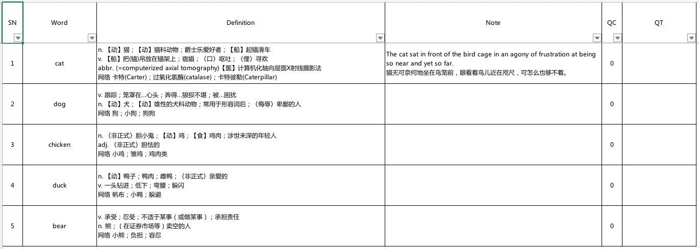

# Vocabulary

[简体中文](./vocabulary.zh-Hans.md)

### 1. Introduction

File `vocabulary.go` defines some basic data structures.

### 2. Query

Take file `animal.xlsx` as an example.



#### 2.1. Basic Query (Exact Match)

If the word **is exactly the same as the content in cell at column "Word" in a line**, data of the line will be selected.

For example, in *basic query*, input word "cat" and data of the line 1 will be selected.

#### 2.2. Advanced Query (Keyword Match)

If the word **is contained by the content in cells at columns "Word", "Definition" or "Note" in a line**, the line will be selected.

For example, in *advanced query*, input word "e" and the data of line 1, 3 and 5 will be selected.

### 3. VocabularyAskStruct

```go
type VocabularyAskStruct struct {
	Word        string `json:"word"`
	Advance     bool   `json:"advance"`
	Online      bool   `json:"online"`
	DoNotRecord bool   `json:"doNotRecord"`
}
```

This structure indicates the word and options of query.

#### 3.1. Word

`Word` indicates the word for query.

#### 3.2. Advance

If `Advance` is `false`, the core library will do *basic query* of `Word` only.

If `Advance` is `true`, the core library will do both *basic query* and *advanced query* of `Word`.

#### 3.3. Online

If `Online` is `true`, the core library will know that users need query `Word` online.

**Note that it doesn't ensure that the core library will query `Word` online.** Whether the core library does also depends on `online.mode` in *configuration* (at [here](./main.md#2431-mode)).

#### 3.4. DoNotRecord

If `DoNotRecord` is `true`, the core library will not *record* the *vocabulary* to any *collections* and *dictionaries*.

### 4. VocabularyAnswerStruct

```go
const (
	Basic = "basic"
	Advance = "advance"
	Collection = 1
	Dictionary = 2
	Online = 3
)

type VocabularyAnswerStruct struct {
	Word         string         `json:"word"`         // `xlsx:wd`
	Definition   []string       `json:"definition"`   // `xlsx:def`
	SerialNumber int            `json:"serialNumber"` // `xlsx:sn`
	QueryCounter int            `json:"queryCounter"` // `xlsx:qc`
	QueryTime    string         `json:"queryTime"`    // `xlsx:qt`
	Note         []string       `json:"note"`         // `xlsx:nt`
	SourceName   string         `json:"sourceName"`
	Status       string         `json:"status"`
	Location     LocationStruct `json:"location"`
}

type LocationStruct struct {
	TableType  int `json:"tableType"`
	TableIndex int `json:"tableIndex"`
	ItemIndex  int `json:"itemIndex"`
}
```

This is the data structure of the *vocabulary*.

#### 4.1. Word

`Word` indicates the word in the *vocabulary*.

#### 4.2. Definition

`Definition` indicates definitions in the *vocabulary*.

#### 4.3. SerialNumber

`SerialNumber` indicates the serial number of the *vocabulary*.

#### 4.4. QueryCounter

`QueryCounter` indicates the query counter of the *vocabulary*.

#### 4.5. Note

`Note` indicates notes in the *vocabulary*.

#### 4.6. QueryTime

`QueryTime` indicates the last query time of the *vocabulary*.

#### 4.7. SourceName

`SourceName` indicates where the *vocabulary* comes from. It can be the name of:

- the *collection*
- the *dictionary*
- the *service*

#### 4.8. Status

`Status` indicates some other information.

If the *vocabulary* comes from the *collection* or the *dictionary*:

- If the *vocabulary* comes from *basic query*, its `Status` will be `Basic`.
- If the *vocabulary* comes from *advanced query*, its `Status` will be `Advance`.

If the *vocabulary* comes from the *service*, its `Status` will be `Basic`.

#### 4.9. Location

`Location` is used to locate the *vocabulary* in *collections* or *dictionaries*.

It is a structure and has got these members:

- `TableType` indicates the source of the *vocabulary*.
  - If the *vocabulary* comes from the *collection*, it will be `Collection`.
  - If the *vocabulary* comes from the *dictionary*, it will be `Dictionary`.
  - If the *vocabulary* comes from the *service*, it will be `Online`.
- `TableIndex` indicates the index of the *collection* or the *dictionary* (depends on `TableType`) which the *vocabulary* belongs to in the list.
- `ItemIndex` indicates the *vocabulary's* index in the *collection* or the *dictionary*.

**These indexes begin with 0.**

### 5. VocabularyResultStruct

```go
type VocabularyResultStruct struct {
	Basic   []vocabulary4mydictionary.VocabularyAnswerStruct `json:"basic"`
	Advance []vocabulary4mydictionary.VocabularyAnswerStruct `json:"advance"`
}
```

`Basic` is made up by *vocabularies* come from *basic query*.

`Advance` is made up by *vocabularies* come from *advanced query*.

### 6. VocabularyEditStruct

```go
type VocabularyEditStruct struct {
	Location   LocationStruct `json:"location"`
	Definition string         `json:"definition"`
	Note       string         `json:"note"`
}
```

This structure is used to provide information for editting a *vocabulary* in *collection* or *dictionary*.

#### 6.1. Location

`Location` is same as \#4.9.

#### 6.2. Definition

`Definition` indicates amended definitions.

#### 6.3. Note

`Note` indicates amended notes.

### 7. Others

- All code files are edited by [Atom](https://atom.io/).
- All ".md" files are edited by [Typora](http://typora.io).
- The style of all ".md" files is [Github Flavored Markdown](https://guides.github.com/features/mastering-markdown/#GitHub-flavored-markdown).
- There is a LF (Linux) at the end of each line.
