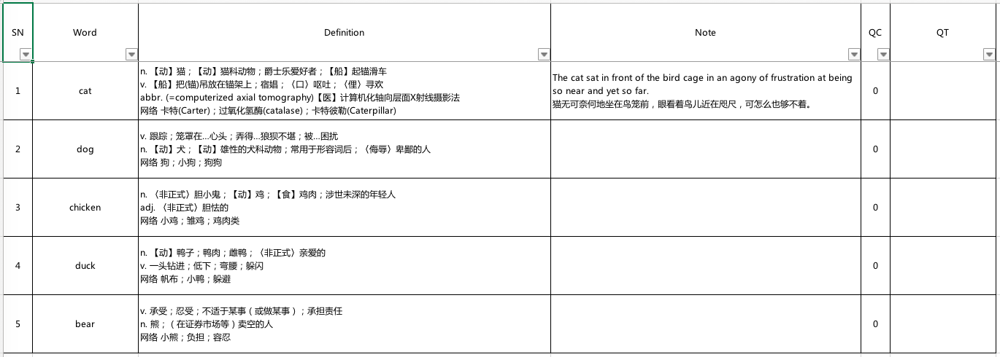

# 词条

[English](./vocabulary.md)

### 1. 简介

文件`vocabulary.go`定义了一些基本数据结构。

### 2. 查询

以文件`animal.xlsx`为例。



#### 2.1. 基本查询（精确匹配）

如果查询词**与列“Word”中的某个单元格完全相同**，那么该行的数据会被选出。

例如：对查询词“cat”进行*基础查询*，第1行数据会被选出。

#### 2.2. 高级查询（关键字匹配）

如果查询词**被包含在列“Word”、“Definition”或“Note”中的某些单元格中**，那么这些行的数据会被选出。

例如：对查询词“e”进行*高级查询*，第1、3、5行的数据会被选出。

### 3. VocabularyAskStruct

```go
type VocabularyAskStruct struct {
	Word        string `json:"word"`
	Advance     bool   `json:"advance"`
	Online      bool   `json:"online"`
	DoNotRecord bool   `json:"doNotRecord"`
}
```

这个数据结构用来指示查询词和查询选项。

#### 3.1. Word

`Word`指示了查询词。

#### 3.2. Advance

如果`Advance`为`false`，那么核心库只会对查询词做*基本查询*。

如果`Advance`为`true`，那么核心库会对查询词做*基本查询*和*高级查询*。

#### 3.3. Online

如果`Online`为`true`，那么核心库会被告知用户需要对`Word`做在线查询。

**注意：这并不保证核心库会对`Word`做在线查询。** 核心库执行与否还取决于*配置*中的`online.mode`（详见[这里](./main.zh-Hans.md#2431-mode)）。

#### 3.4. DoNotRecord

如果`DoNotRecord`为`true`，那么核心库不会把-*词条*-*记录*-到任何*生词本*或*离线词典*中。

### 4. VocabularyAnswerStruct

```go
const (
	Basic = "basic"
	Advance = "advance"
	Collection = 1
	Dictionary = 2
	Online = 3
)

type VocabularyAnswerStruct struct {
	Word         string         `json:"word"`         // `xlsx:wd`
	Definition   []string       `json:"definition"`   // `xlsx:def`
	SerialNumber int            `json:"serialNumber"` // `xlsx:sn`
	QueryCounter int            `json:"queryCounter"` // `xlsx:qc`
	QueryTime    string         `json:"queryTime"`    // `xlsx:qt`
	Note         []string       `json:"note"`         // `xlsx:nt`
	SourceName   string         `json:"sourceName"`
	Status       string         `json:"status"`
	Location     LocationStruct `json:"location"`
}

type LocationStruct struct {
	TableType  int `json:"tableType"`
	TableIndex int `json:"tableIndex"`
	ItemIndex  int `json:"itemIndex"`
}
```

这是*词条*的数据结构。

#### 4.1. Word

`Word`指示了*词条*中的词汇。

#### 4.2. Definition

`Definition`指示了*词条*中的释义。

#### 4.3. SerialNumber

`SerialNumber`指示了*词条*的序号。

#### 4.4. QueryCounter

`QueryCounter`指示了*词条*的查询次数。

#### 4.5. Note

`Note`指示了*词条*中的笔记。

#### 4.6. QueryTime

`QueryTime`指示了*词条*的上次查询时间。

#### 4.7. SourceName

`SourceName`指示了词条的来源。它可以是下列各项的名字：

- *生词本*
- *离线词典*
- *在线服务*

#### 4.8. Status

`Status`指示了一些其他的信息。

如果*词条*来源于*生词本*或*离线词典*：

- 如果*词条*来源于*基本查询*，那么它的`Status`为`Basic`。
- 如果*词条*来源于*高级查询*，那么它的`Status`为`Advance`。

如果*词条*来源于*在线服务*，那么它的`Status`为`Basic`。

#### 4.9. Location

`Location`用于定位*词条*在*生词本*或*在线词典*中的位置。

它是一个结构体，包含下列成员：

- `TableType`指出了*词条*的来源。
  - 如果*词条*来源于*生词本*，那么该成员为`Collection`。
  - 如果*词条*来源于*离线词典*，那么该成员为`Dictionary`。
  - 如果*词条*来源于*在线服务*，那么该成员为`Online`。
- `TableIndex`指出了*词条*所属的*生词本*或*在线词典*（取决于`TableType`）在列表中的索引。
- `ItemIndex`指出了*词条*在*生词本*或*在线词典*中的索引。

**上述索引从0开始。**

### 5. VocabularyResultStruct

```go
type VocabularyResultStruct struct {
	Basic   []vocabulary4mydictionary.VocabularyAnswerStruct `json:"basic"`
	Advance []vocabulary4mydictionary.VocabularyAnswerStruct `json:"advance"`
}
```

`Basic`由来自*基本查询*的*词条*构成。

`Advance`由来自*高级查询*的*词条*构成。

### 6. VocabularyEditStruct

```go
type VocabularyEditStruct struct {
	Location   LocationStruct `json:"location"`
	Definition string         `json:"definition"`
	Note       string         `json:"note"`
}
```

这个结构体给出一些信息，以便编辑*生词本*或*离线词典*中*词条*。

#### 6.1. Location

`Location`与\#4.9中的相同。

#### 6.2. Definition

`Definition`指示了修改后的释义。

#### 6.3. Note

`Note`指示了修改后的笔记。

### 7. 其他

- 所以代码文件是用[Atom](https://atom.io/)编写的。
- 所有".md"文件是用[Typora](http://typora.io)编写的。
- 所有".md"文件的风格是[Github Flavored Markdown](https://guides.github.com/features/mastering-markdown/#GitHub-flavored-markdown)。
- 各行以LF（Linux）结尾。

